# 🚀 Research & Development

### 🔬 Focus Area
* **Master's Candidate at SKKU**
* **Specialization**: Fail-safe systems for Autonomous Vehicles & 3D Bounding Box Perception
* **Tools**: ROS 2 (Humble), C++, Python, CARLA Simulator

---

### 💻 Tech Stack
   

---

### 📊 GitHub Activity

  
   
  

---

### 🎥 Research Visualization

  
  

  <strong>Dynamic Sensor Selection</strong> | <strong>Behavior Tree Logic</strong>

